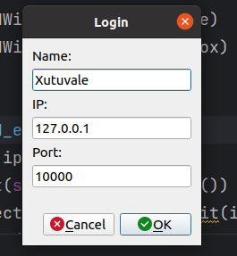
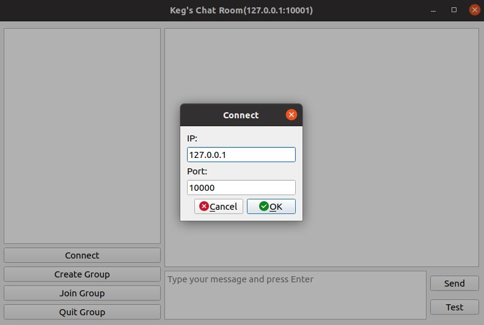
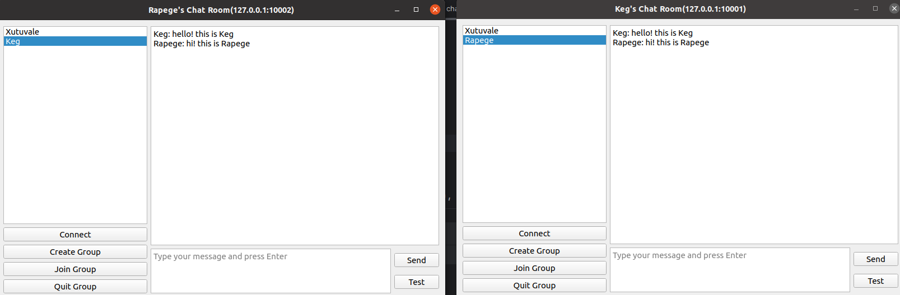

# p2p-chat-room
This project is the final homework of distributed system. The institution for this course is Sun Yat sen University.


#### prepared environment

```shell
sudo apt install python3

sudo apt-get install python3-pyqt5
sudo apt install qttools5-dev
sudo apt install qttools5-dev-tools

pip3 install grpcio
pip3 install grpcio-tools
```


#### run

```shell
git clone https://github.com/lzy-learning/p2p-chat-room.git

cd p2p-chat-room

python3 main.py
```


#### display







